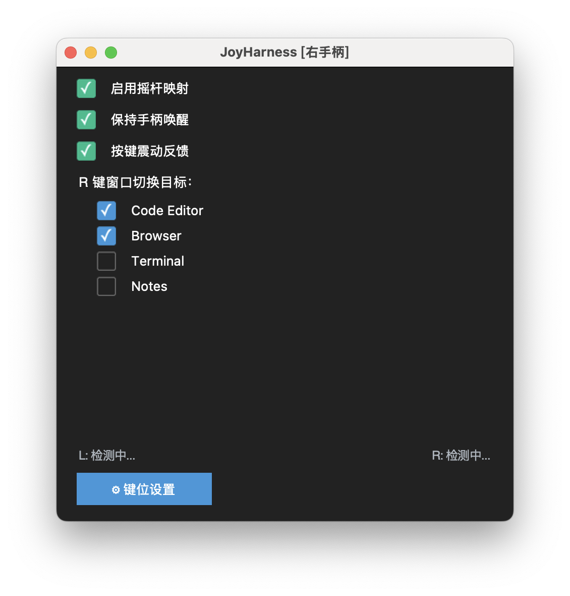

# JoyHarness

**把 Nintendo Switch Joy-Con 变成一只随手可用的桌面快捷键遥控器。**

JoyHarness 将蓝牙连接的 Joy-Con 映射为键盘快捷键、窗口切换和自动化动作，适合演示、阅读、剪辑、写作、轻量开发和任何想把常用操作从键盘上解放出来的桌面工作流。

支持 Windows 11 与 macOS 13+，可自动识别单左手柄、单右手柄和双手柄模式，并为不同连接方式切换对应配置。

## 界面预览

<p align="center">
  
</p>

| macOS | Windows |
|-------|---------|
|  |  |

## 适合谁

- 想用 Joy-Con 做演示翻页、窗口切换、快捷键触发的人
- 想把常用桌面操作映射到单手遥控器的人
- 想在 Windows 和 macOS 上复用同一套 Joy-Con 工作流的人

## 功能特性

- **多手柄模式** — 自动检测右手柄 / 左手柄 / 双手柄，切换对应键位配置
- **热插拔** — 断开重连自动恢复
- **丰富的按键映射** — tap、hold、auto（短按/长按自适应）、combination（组合键）、sequence（序列键）、macro（宏）、window_switch、exec（Shell 命令）
- **摇杆映射** — 4/8 方向，可配死区
- **窗口切换** — 快速切换指定应用窗口
- **GUI 设置** — 可视化编辑键位映射
- **电量显示** — HID 读取 Joy-Con 电量
- **保活防休眠** — 周期性零强度震动
- **震动反馈** — 按键和窗口切换时给出轻量触觉反馈

## 快速开始

### 环境要求

- **Windows 11** 或 **macOS 13+**
- Python 3.10+
- Joy-Con 已通过蓝牙配对

### 安装

```bash
pip install -r requirements.txt
```

依赖已按平台自动分流：Windows 安装 `keyboard`，macOS 安装 `pynput` + PyObjC。

### 蓝牙配对

1. 打开系统蓝牙设置
2. 按住 Joy-Con 滑轨上的小配对按钮 3 秒（指示灯快速闪烁）
3. 在蓝牙列表中选择 Joy-Con

### 运行

```bash
python -m src
```

macOS 可双击 `start.command` 或 `JoyHarness.app`，Windows 可双击 `start.vbs`。

macOS 首次运行需在 **系统设置 → 隐私与安全性** 中授予 **辅助功能** 和 **输入监控** 权限。

### 常用命令行参数

```
python -m src --discover        # 校准：显示按钮/轴的原始索引值
python -m src --config my.json  # 使用自定义配置文件
python -m src --list-controls   # 列出当前映射
python -m src --verbose         # 调试日志
```

## 配置

配置文件位于 `config/` 目录，JSON 格式：

- `user.json` — 主配置文件（优先加载）
- `user-macos.json` — macOS 预设
- `user-windows.json` — Windows 预设
- `default.json` — 内置默认

程序启动时自动根据平台选择配置：优先 `user.json`，其次 `user-{platform}.json`。

### 连接模式

| 模式 | 可用按钮 |
|------|----------|
| `single_right` 右手柄 | A/B/X/Y/R/ZR/Plus/Home/RStick/SL/SR |
| `single_left` 左手柄 | A/B/X/Y/L/ZL/Minus/Capture/LStick/SL/SR |
| `dual` 双手柄 | 全部按钮 |

### 动作类型

| 动作 | 说明 |
|------|------|
| **tap** | 点击后立即松开 |
| **hold** | 按下保持，松开释放（修饰键用） |
| **auto** | 短按 = tap，长按 = hold。加 `repeat` 字段可连续重击 |
| **combination** | 同时按多个键（如 Cmd+S） |
| **sequence** | 按住修饰键 + 点击其他键（如 Alt+Tab） |
| **window_switch** | 短按切下一个窗口，长按弹出选择器 |
| **macro** | 预定义按键序列，可按前台窗口过滤 |
| **exec** | 执行 Shell 命令（如 `open -a "Mission Control"`） |

### macOS 专用配置示例

```json
{
  "ZR": { "action": "hold", "key": "alt_r" },
  "Plus": { "action": "hold", "key": "cmd_r" },
  "R": { "action": "exec", "command": ["open", "-a", "Mission Control"] },
  "Y": { "action": "combination", "keys": ["cmd", "tab"] },
  "Home": { "action": "combination", "keys": ["cmd", "space"] },
  "B": { "action": "auto", "key": "backspace", "repeat": 100 }
}
```

> macOS 上部分系统快捷键（如 F3 → Mission Control）只响应硬件 HID 事件，不响应 pynput 合成的按键。这类场景请用 `exec` 动作。

## macOS 注意事项

- **权限**：需要「辅助功能」和「输入监控」权限
- **进程名大小写敏感**：窗口切换目标必须匹配系统里的真实应用进程名
- **全屏窗口**：`window_switch` 只能看到当前 Space 的窗口
- **SL/SR 侧键**：在 macOS 上 SDL2 检测不稳定，建议映射为其他功能

## 项目结构

```
src/
├── main.py              # CLI 入口 + 线程编排
├── config_loader.py     # 配置加载/校验/保存（平台自动选择）
├── constants.py         # 硬件常量、默认映射
├── joycon_reader.py     # pygame 手柄轮询、热插拔重连
├── key_mapper.py        # 事件翻译引擎（核心）
├── keyboard_output.py   # 键盘模拟（Windows=keyboard / macOS=pynput）
├── window_switcher.py   # 窗口枚举/切换（Win32 / Quartz+AppleScript）
├── gui.py               # 主窗口
├── settings_window.py   # 设置面板
├── switcher_overlay.py  # 窗口切换叠加层
├── tray_icon.py         # 系统托盘图标（仅 Windows）
├── battery_reader.py    # HID 电量读取
├── keep_alive.py        # 保活防休眠
└── platform/            # 平台检测 + 权限检查
```

## 更新日志

### macOS 适配

- **跨平台键盘模拟** — Windows 用 `keyboard`，macOS 用 `pynput`
- **跨平台窗口管理** — macOS 用 PyObjC + Quartz（AppleScript 兜底）
- **新增 `exec` 动作** — 绑定 Shell 命令到按键（Mission Control、Launchpad 等）
- **新增 `auto` 连发** — `repeat` 字段实现软件层面的按键连发
- **平台配置自动选择** — 根据操作系统加载对应的配置文件
- **pygame 选择性初始化** — 减少 SDL2 对 macOS 窗口管理的干扰
- **窗口切换性能优化** — PyObjC + Quartz 路径延迟约 20ms（vs AppleScript 约 500ms）
- **Bug 修复** — 8 向摇杆判定、窗口切换状态机、GUI 配置保存大小写

## 许可证

[MIT](LICENSE)
